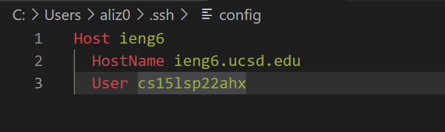
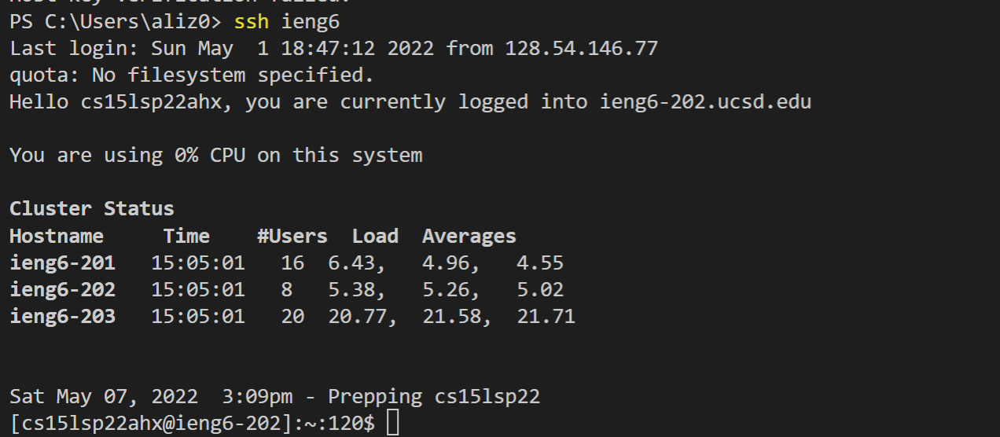
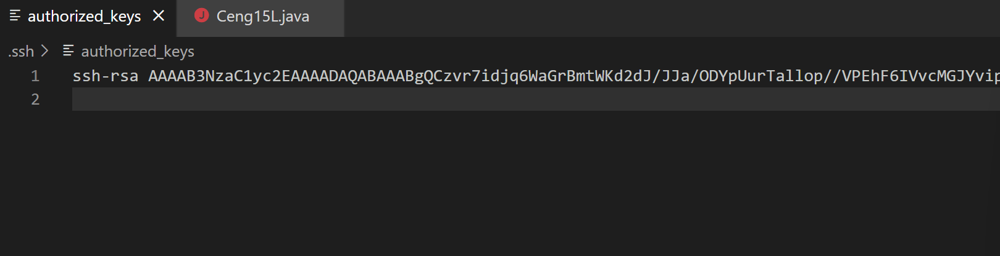
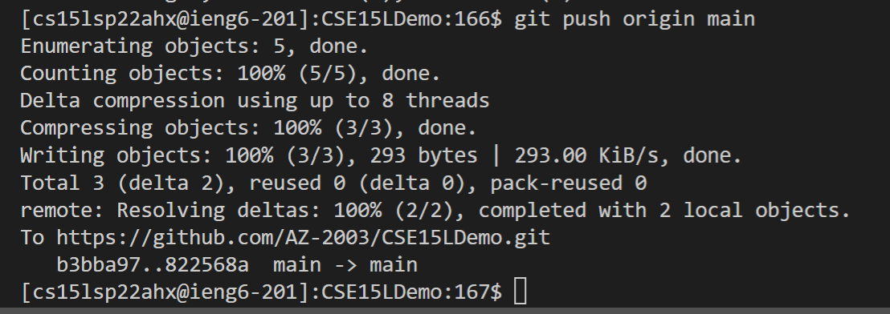
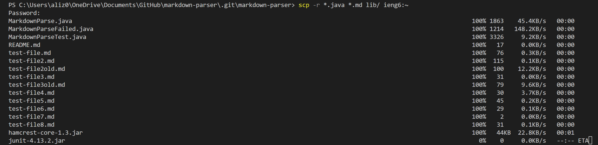
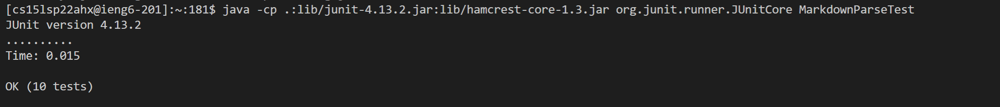
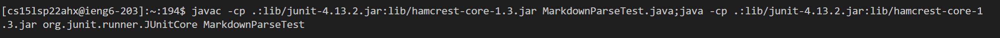

# Ali's CSE 15L Lab Report
## Automated Unix Commands
---
### **Motivation**
This Blog Post is served to deal with more Unix Commands as we expand our repotoire in not only dealing with Remote servers but involving Github repositries as well. Additionally, we will deal with *ssh files* as we further delve further into the command line.  

### **Streamlining ssh Confoguration**
By configuring the entries recognized SSH, you can streamline your access to the servers you want to access.  
- To access the file involving the configurations, type ```~/.ssh/config``` into your terminal; you will be asked to open the file in a text editor of your choice (in our case, we will use *VS Code*)  
- Type the following:

    #### **Disclaimers**
    - *"ieng6"* can be replaced with a name of your choosing
    - *"cs15lsp22ahx"* should be the username of the remote server  
      
-  Such configuration is very beneficial in shortening the commands given in not only accesing the remote server:  

- but also in copying files into said remote server:  

---
### **Setting up a connection between Github & the Remote Server**
You can connect your remote server to your Github account my managing your SSH keys. By setting up a connection between your Github, you can push all your commits into the main branch of the Github repository without using the client servers.  

- First thing involves creating an SSH key in your Github account where that SSH key is that used for access to your remote server. This can be doen by following the steps given by the [tutorial](https://docs.github.com/en/authentication/connecting-to-github-with-ssh/adding-a-new-ssh-key-to-your-github-account):  
- To access the public key,go through your remote server folders and open the file that says ```authorised_keys```.It should look like the following:
  
- Of course, for each public key, there is a private key generated; this too can be accessed by typing ```~/.ssh/location``` where *location* is to be replaced with the folder where your SSH key is located (this is determined when you created your SSH key). Here are examples (2 SSH keys with unique locations):

- With the connection established, we can push our commits to Githuab directly through the remote server:  

- link for the commit: [commit](https://github.com/AZ-2003/CSE15LDemo/commit/822568aa3f1e5e3e26d58bc8b25a134b2182928f)
---
### **Using ```scp -r``` to copy directories**
You can use ```scp -r``` to help copy directories consisting of numerous files all through one commands
- This is shown through the two images below: (the remote server did not have the files previously)
 


- the second file shows that the tester file (MarkdownParseTester.java) was run on the remote server indicating that not only the files was moved, but also the libraries and test cases.  
- Ideally, this process can be optimized such that the following can be done:
    - using ```;``` we can combine numerous commands togther; in this case, we combine the *copy command* as well as the command related to the *remote server access* :

    - then, we use the upper arrow keys (previous commands) to do the previous commands - while at the remote server

---
### **Wrap up**
This is the end of the blog post; I hope you foundit useful. **Happy Coding!**


